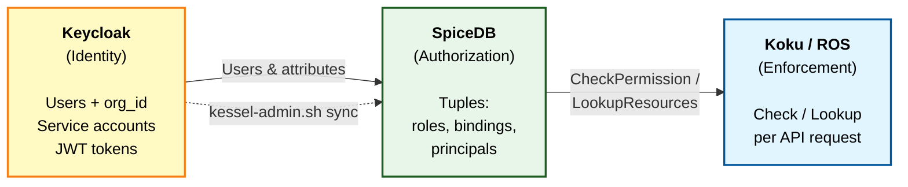
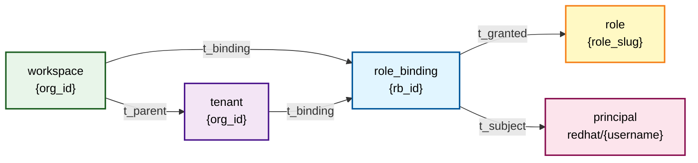

# Kessel Authorization Management

This guide covers the authorization management plane for Cost Management On-Premise. It explains how users are synchronized from Keycloak into Kessel (SpiceDB), how roles are assigned, and how to use the provided scripts to manage access.

## What is Kessel?

[Kessel](https://github.com/project-kessel) is Red Hat's Relationship-Based Access Control (ReBAC) platform, built on top of [SpiceDB](https://github.com/authzed/spicedb) (an open-source implementation of Google's [Zanzibar](https://research.google/pubs/pub48190/) authorization system). It provides fine-grained, policy-driven authorization by evaluating relationships (tuples) stored in SpiceDB.

Key repositories:

| Repository | Purpose |
|---|---|
| [project-kessel/relations-api](https://github.com/project-kessel/relations-api) | gRPC API for reading and writing authorization tuples |
| [project-kessel/inventory-api](https://github.com/project-kessel/inventory-api) | Resource inventory and reporter management |
| [authzed/spicedb](https://github.com/authzed/spicedb) | The core authorization database |

In Cost Management On-Premise, Kessel replaces the SaaS `insights-rbac` service. Every API request is authorized by checking SpiceDB tuples rather than relying on an `is_org_admin` flag.

## Architecture Overview



1. **Keycloak** manages user identities, credentials, and org_id attributes
2. **SpiceDB** stores authorization tuples (who has what role in which org)
3. **Koku / ROS** enforce authorization by calling SpiceDB on every API request

The management plane scripts bridge Keycloak and SpiceDB — they read users from Keycloak and write the corresponding authorization tuples to SpiceDB.

## Prerequisites

| Tool | Purpose |
|---|---|
| `oc` | OpenShift CLI, logged in with cluster-admin |
| `grpcurl` | gRPC CLI for SpiceDB communication ([install](https://github.com/fullstorydev/grpcurl)) |
| `jq` | JSON processor |
| `curl` | HTTP client |

All scripts are in the `scripts/` directory of the ros-helm-chart repository.

## Deployment Sequence

Kessel components must be deployed before running management commands:

```bash
# 1. Deploy Keycloak (identity provider)
./scripts/deploy-rhbk.sh

# 2. Deploy Kessel stack (SpiceDB, Relations API, Inventory API)
./scripts/deploy-kessel.sh

# 3. Deploy the Helm chart (Koku migration seeds role definitions)
./scripts/install-helm-chart.sh

# 4. Bootstrap authorization (seed roles + sync all users)
./scripts/kessel-admin.sh bootstrap
```

The `bootstrap` command is a one-shot operation that:
1. Seeds role→permission tuples from `seed-roles.yaml`
2. Syncs all Keycloak users to SpiceDB with the default role

After bootstrap, use `sync`, `grant`, and `revoke` for ongoing management.

## Role Model

### Available Roles

Roles are seeded by the Koku migration job (`kessel_seed_roles`) during `helm install`. Each role grants a set of permissions on Cost Management resource types.

| Role Slug | Description |
|---|---|
| `cost-administrator` | Full read + write for all 11 resource types |
| `cost-cloud-viewer` | Read-only for AWS, GCP, Azure accounts and subscription GUIDs |
| `cost-openshift-viewer` | Read-only for OpenShift clusters, projects, and nodes |
| `cost-price-list-administrator` | Read + write for cost models |
| `cost-price-list-viewer` | Read-only for cost models |

### Resource Types

The 11 resource types managed by Cost Management:

| Resource Type | Permissions |
|---|---|
| `openshift_cluster` | read, write |
| `openshift_project` | read, write |
| `openshift_node` | read, write |
| `aws_account` | read, write |
| `azure_subscription_guid` | read, write |
| `gcp_account` | read, write |
| `gcp_project` | read, write |
| `cost_model` | read, write |
| `settings` | read, write |
| `integration` | read, write |
| `all` | read, write (wildcard) |

### Tuple Structure

When a role is granted to a user, 5 tuples are written to SpiceDB:



Where `rb_id` = `{org_id}--{username}--{role_slug}`.

The `workspace→t_parent→tenant` tuple is shared across all bindings in the same org and is idempotent.

## User Synchronization from Keycloak

The Helm chart includes a **CronJob** that automatically syncs Keycloak users to SpiceDB every 5 minutes. This means new users added to Keycloak will receive SpiceDB role bindings within minutes without manual intervention.

The CronJob runs `kessel-admin.sh sync` on a schedule and is enabled by default. It can be configured via Helm values:

```yaml
kessel:
  sync:
    enabled: true                # toggle the CronJob on/off
    schedule: "*/5 * * * *"      # cron schedule (default: every 5 minutes)
    defaultRole: cost-administrator  # role assigned to new users
    image: quay.io/insights-onprem/kessel-tools:latest
    keycloakSecretName: keycloak-initial-admin
    keycloakUsernameKey: username
    keycloakPasswordKey: password
```

You can also run `sync` manually at any time for an immediate refresh. The rest of this section describes how the sync mechanism works under the hood, whether triggered by the CronJob or manually.

### How Sync Works

1. **Fetch users**: Queries the Keycloak Admin API for all users in the configured realm (up to 500)
2. **Extract org_id**: Reads the `org_id` attribute from each user's profile; skips users without it
3. **Build tuples**: For each user, builds 5 `OPERATION_TOUCH` updates granting `DEFAULT_ROLE`
4. **Service accounts**: Also syncs Keycloak service accounts (clients with `serviceAccountsEnabled=true`)
5. **Deduplicate**: Removes duplicate tuples before writing (prevents SpiceDB batch rejection)
6. **Atomic write**: Sends all updates in a single `WriteRelationships` call

### Running Sync

```bash
# Sync all Keycloak users with the default role (cost-administrator)
./scripts/kessel-admin.sh sync

# Sync with a different default role
DEFAULT_ROLE=cost-openshift-viewer ./scripts/kessel-admin.sh sync
```

### What Sync Creates

For each Keycloak user with an `org_id` attribute, sync creates:

| Tuple | Example |
|---|---|
| Role binding → Role | `rbac/role_binding:org1234567--alice--cost-administrator #t_granted rbac/role:cost-administrator` |
| Role binding → Principal | `rbac/role_binding:org1234567--alice--cost-administrator #t_subject rbac/principal:redhat/alice` |
| Workspace → Tenant | `rbac/workspace:org1234567 #t_parent rbac/tenant:org1234567` |
| Workspace → Role binding | `rbac/workspace:org1234567 #t_binding rbac/role_binding:org1234567--alice--cost-administrator` |
| Tenant → Role binding | `rbac/tenant:org1234567 #t_binding rbac/role_binding:org1234567--alice--cost-administrator` |

### When to Run Sync Manually

The CronJob handles periodic sync automatically. You only need to run `sync` manually when:

- **Immediately after initial deployment** — use `bootstrap` instead of waiting for the first CronJob run
- **When you need instant access** — if a new user can't wait up to 5 minutes for the next CronJob cycle
- **After bulk Keycloak changes** — e.g. updating org_id attributes for many users at once

Sync is idempotent — running it multiple times (or overlapping with the CronJob) is safe.

### Service Account Sync

The sync command also processes Keycloak clients with `serviceAccountsEnabled=true`. For each service account:

1. Fetches the service-account user via `GET /clients/{id}/service-account-user`
2. Reads `org_id` from the service-account user's attributes (falls back to `DEFAULT_ORG_ID=org1234567`)
3. Creates the same 5 tuples as for regular users

This ensures that the Cost Management Operator and Inventory API service accounts have proper SpiceDB bindings.

## Keycloak User Requirements

For a user to be authorized in Cost Management, they need:

1. **A Keycloak account** in the configured realm (default: `kubernetes`)
2. **The `org_id` attribute** set on their profile (e.g., `org1234567`)
3. **SpiceDB tuples** created via `sync` or `grant`

### Creating a User in Keycloak

**Via the Admin Console:**
1. Navigate to **Users → Add User**
2. Set username, email, and enable the user
3. Go to **Attributes** tab and add:
   - `org_id` = `org1234567`
   - `account_number` = `7890123`
4. Go to **Credentials** tab and set a password

**Via the Admin API:**
```bash
# Get admin token
KEYCLOAK_URL=$(oc get route keycloak -n keycloak -o jsonpath='{.spec.host}')
ADMIN_PASSWORD=$(oc get secret keycloak-initial-admin -n keycloak \
  -o jsonpath='{.data.password}' | base64 -d)

ADMIN_TOKEN=$(curl -sk -X POST \
  "https://${KEYCLOAK_URL}/realms/master/protocol/openid-connect/token" \
  -d "grant_type=password&client_id=admin-cli&username=admin&password=${ADMIN_PASSWORD}" \
  | jq -r '.access_token')

# Create user
curl -sk -X POST "https://${KEYCLOAK_URL}/admin/realms/kubernetes/users" \
  -H "Authorization: Bearer ${ADMIN_TOKEN}" \
  -H "Content-Type: application/json" \
  -d '{
    "username": "alice",
    "email": "alice@example.com",
    "emailVerified": true,
    "enabled": true,
    "attributes": {
      "org_id": ["org1234567"],
      "account_number": ["7890123"]
    }
  }'

# Set password
USER_ID=$(curl -sk "https://${KEYCLOAK_URL}/admin/realms/kubernetes/users?username=alice&exact=true" \
  -H "Authorization: Bearer ${ADMIN_TOKEN}" | jq -r '.[0].id')

curl -sk -X PUT "https://${KEYCLOAK_URL}/admin/realms/kubernetes/users/${USER_ID}/reset-password" \
  -H "Authorization: Bearer ${ADMIN_TOKEN}" \
  -H "Content-Type: application/json" \
  -d '{"type":"password","value":"alice-password","temporary":false}'
```

After creating the user, run `sync` to create their SpiceDB bindings:
```bash
./scripts/kessel-admin.sh sync
```

Or grant a specific role directly:
```bash
./scripts/kessel-admin.sh grant alice cost-openshift-viewer org1234567
```

## Management Commands Reference

### `bootstrap`

One-shot initialization: seeds roles then syncs all users.

```bash
./scripts/kessel-admin.sh bootstrap
```

Run this once after the initial Helm install. It is safe to re-run.

### `sync`

Sync all Keycloak users and service accounts to SpiceDB.

```bash
./scripts/kessel-admin.sh sync
```

All users receive `DEFAULT_ROLE` (default: `cost-administrator`). To use a different default:

```bash
DEFAULT_ROLE=cost-openshift-viewer ./scripts/kessel-admin.sh sync
```

### `grant`

Grant a specific role to a user in an org.

```bash
./scripts/kessel-admin.sh grant <username> <role-slug> <org_id>

# Examples:
./scripts/kessel-admin.sh grant alice cost-openshift-viewer org1234567
./scripts/kessel-admin.sh grant bob cost-price-list-administrator org1234567
```

### `revoke`

Revoke a role from a user.

```bash
./scripts/kessel-admin.sh revoke <username> <role-slug> <org_id>

# Example:
./scripts/kessel-admin.sh revoke alice cost-administrator org1234567
```

This deletes 4 tuples (role binding → role, role binding → principal, workspace → role binding, tenant → role binding). The workspace → tenant tuple is preserved as it may be shared.

### `check`

Verify whether a user has a specific permission.

```bash
./scripts/kessel-admin.sh check <username> <permission> <org_id>

# Examples:
./scripts/kessel-admin.sh check alice cost_management_openshift_cluster_read org1234567
./scripts/kessel-admin.sh check bob cost_management_cost_model_write org1234567
```

Permission names follow the pattern `cost_management_{resource_type}_{read|write}`. The full list:

```
cost_management_openshift_cluster_read
cost_management_openshift_cluster_write
cost_management_openshift_project_read
cost_management_openshift_project_write
cost_management_openshift_node_read
cost_management_openshift_node_write
cost_management_aws_account_read
cost_management_aws_account_write
cost_management_azure_subscription_guid_read
cost_management_azure_subscription_guid_write
cost_management_gcp_account_read
cost_management_gcp_account_write
cost_management_gcp_project_read
cost_management_gcp_project_write
cost_management_cost_model_read
cost_management_cost_model_write
cost_management_settings_read
cost_management_settings_write
cost_management_integration_read
cost_management_integration_write
cost_management_all_read
cost_management_all_write
```

### `list-users`

List Keycloak users with their org_id and account attributes.

```bash
./scripts/kessel-admin.sh list-users
```

### `status`

Show current SpiceDB tuple counts by resource type.

```bash
./scripts/kessel-admin.sh status
```

### `seed-roles`

Manually seed role→permission tuples from `seed-roles.yaml`. This is normally handled by the Koku migration job during `helm install`, but can be run manually if the migration failed.

```bash
./scripts/kessel-admin.sh seed-roles
```

## Common Workflows

### Adding a New User

```bash
# 1. Create user in Keycloak (via Admin Console or API)
# 2. Sync to SpiceDB
./scripts/kessel-admin.sh sync

# 3. Optionally assign a specific role (instead of the default)
./scripts/kessel-admin.sh revoke newuser cost-administrator org1234567
./scripts/kessel-admin.sh grant newuser cost-openshift-viewer org1234567

# 4. Verify
./scripts/kessel-admin.sh check newuser cost_management_openshift_cluster_read org1234567
```

### Changing a User's Role

```bash
# Revoke the old role
./scripts/kessel-admin.sh revoke alice cost-administrator org1234567

# Grant the new role
./scripts/kessel-admin.sh grant alice cost-openshift-viewer org1234567

# Verify
./scripts/kessel-admin.sh check alice cost_management_openshift_cluster_read org1234567
# Expected: ALLOWED

./scripts/kessel-admin.sh check alice cost_management_cost_model_write org1234567
# Expected: DENIED
```

### Verifying the Authorization State

```bash
# Show tuple counts
./scripts/kessel-admin.sh status

# List users
./scripts/kessel-admin.sh list-users

# Check specific permissions
./scripts/kessel-admin.sh check admin cost_management_all_read org1234567
./scripts/kessel-admin.sh check test cost_management_openshift_cluster_read org1234567
```

## Environment Variables

| Variable | Default | Purpose |
|---|---|---|
| `KESSEL_NAMESPACE` | `kessel` | Namespace for SpiceDB and Relations API |
| `KEYCLOAK_NAMESPACE` | `keycloak` | Namespace for Keycloak |
| `KEYCLOAK_REALM` | `kubernetes` | Keycloak realm name |
| `KEYCLOAK_ADMIN` | `admin` | Keycloak admin username |
| `KEYCLOAK_PASSWORD` | (from secret) | Keycloak admin password (auto-detected from `keycloak-initial-admin` secret) |
| `KEYCLOAK_URL` | (from route) | Keycloak admin URL (auto-detected from OpenShift route) |
| `SPICEDB_HOST` | `spicedb.kessel.svc.cluster.local` | SpiceDB gRPC host |
| `SPICEDB_PORT` | `50051` | SpiceDB gRPC port |
| `SPICEDB_PRESHARED_KEY` | (from secret) | SpiceDB authentication token (auto-detected from `spicedb-config` secret) |
| `DEFAULT_ROLE` | `cost-administrator` | Role assigned during `sync` |
| `DEFAULT_ORG_ID` | `org1234567` | Fallback org_id for service accounts without one |

## Valkey Cache

Koku caches SpiceDB authorization decisions in Valkey (Redis-compatible). After changing roles with `grant` or `revoke`, the cache may serve stale results for up to the configured TTL.

To force immediate effect, flush the cache:

```bash
oc exec -n cost-onprem deployment/cost-onprem-valkey -- valkey-cli FLUSHALL
```

## Troubleshooting

### User Gets 403 After Grant

1. **Check the grant succeeded:**
   ```bash
   ./scripts/kessel-admin.sh check username permission org_id
   ```

2. **Flush the Valkey cache** (Koku caches authorization decisions):
   ```bash
   oc exec -n cost-onprem deployment/cost-onprem-valkey -- valkey-cli FLUSHALL
   ```

3. **Verify the user's org_id** matches the deployed org:
   ```bash
   ./scripts/kessel-admin.sh list-users
   ```

### Sync Reports 0 Users

1. **Check Keycloak connectivity:**
   ```bash
   oc get route keycloak -n keycloak
   ```

2. **Verify users have org_id attribute** — sync skips users without it

3. **Check admin credentials:**
   ```bash
   oc get secret keycloak-initial-admin -n keycloak
   ```

### SpiceDB Connection Errors

1. **Verify SpiceDB is running:**
   ```bash
   oc get pods -n kessel -l app=spicedb
   ```

2. **Check the preshared key:**
   ```bash
   oc get secret spicedb-config -n kessel -o jsonpath='{.data.preshared_key}' | base64 -d
   ```

3. **Ensure grpcurl is installed:**
   ```bash
   which grpcurl || echo "Install from https://github.com/fullstorydev/grpcurl"
   ```

## Related Documentation

- **[Installation Guide](installation.md)** — Full deployment sequence including Kessel
- **[Keycloak JWT Authentication Setup](../api/keycloak-jwt-authentication-setup.md)** — JWT auth and claim configuration
- **[Scripts Reference](../../scripts/README.md)** — All deployment and management scripts
- **[Troubleshooting Guide](troubleshooting.md)** — General troubleshooting
- **[Kessel Detailed Design](https://github.com/insights-onprem/koku/blob/main/docs/architecture/kessel-integration/kessel-ocp-detailed-design.md)** — Authorization architecture in Koku

---

**Last Updated**: March 2026
